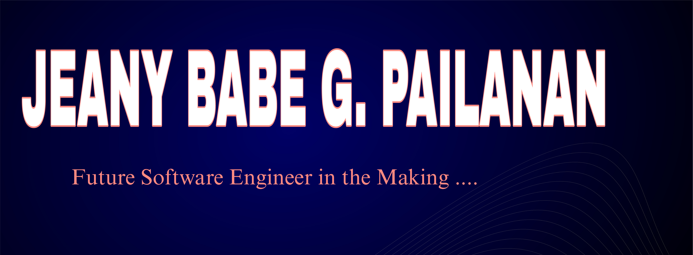
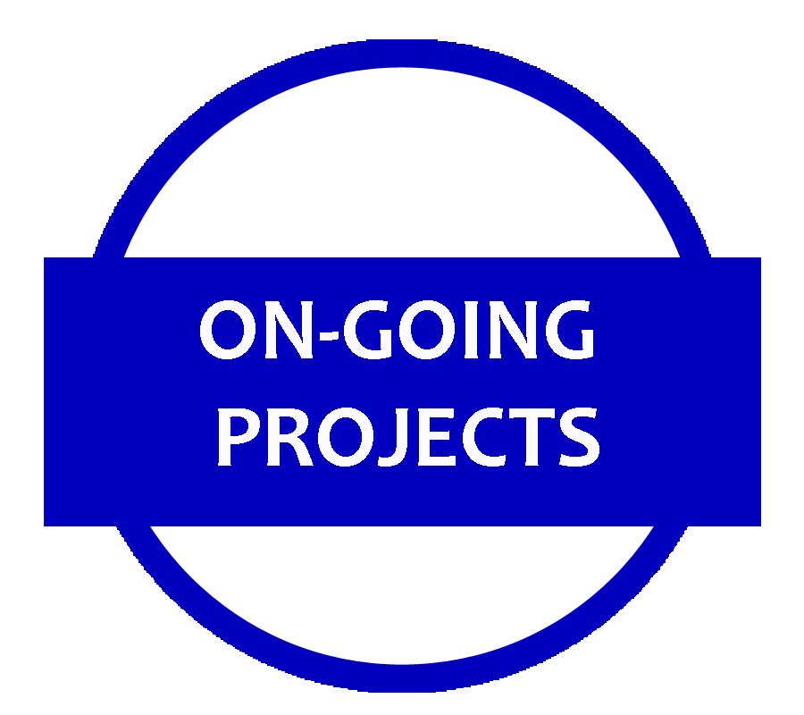
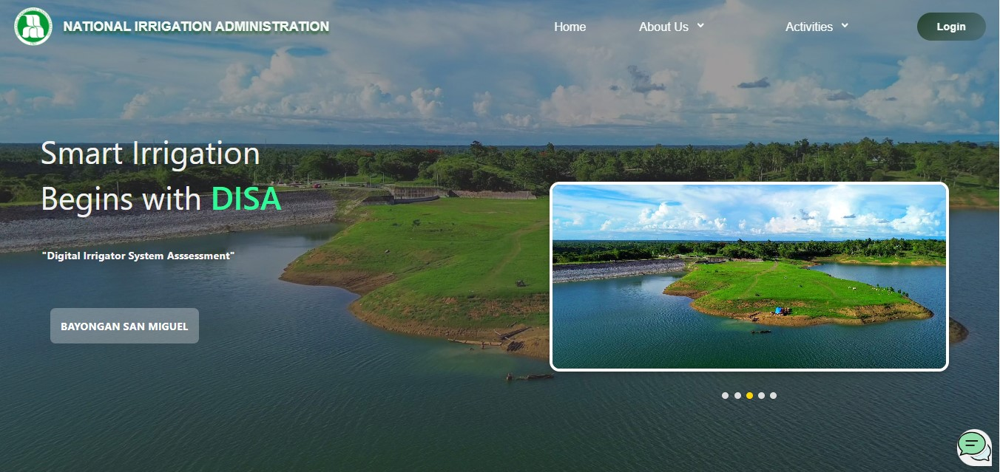
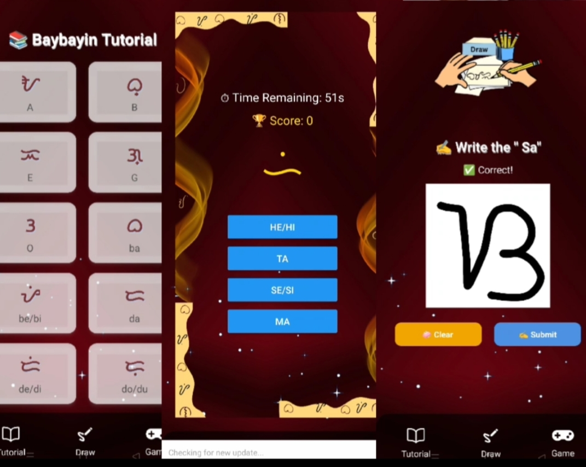
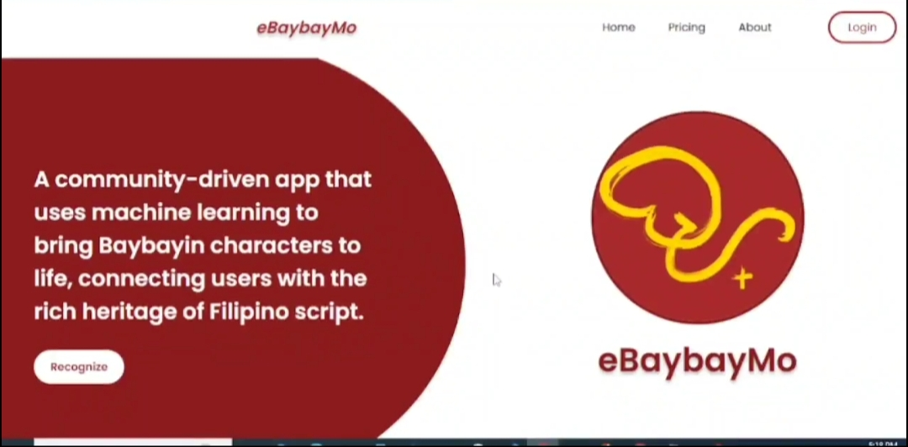

<!-- Banner with name in the background image -->

  

---

## 👨‍💻 About Me

I'm a curious and passionate **student developer** who loves exploring new technologies and solving real-world problems through code.  
Currently diving deep into **Artificial Intelligence** and **Machine Learning**, always eager to learn more and grow as a developer.  

I’m fascinated by how AI can be used to build smarter tools, automate tasks, and make everyday life better.

  

---

## 🧰 Tech Stack

  
  
  
  
  
  
  
  

---

## 📁 Projects

| Project | Status | Role | Preview | Description |
|--------|--------|------|---------|-------------|
| 🮠Game Projects | Ongoing | Lead Developer |  | Developing a series of games: an **RPG**, a **side-scrolling platformer**, and a **shooting game** — each focused on fun and learning |
| 🚗 Car Parts ML App | Ongoing |  Lead Developer |  | A machine learning app that recognizes car parts from images |
| ğŸ›ï¸ DISA (NIA Region 7) | Active | Project Leader |  | Leading the development of an internal app for government workflows |
| 🕹️ eBaybayMo Game App | In Development | Developer |  | An educational game version of eBaybayMo using ML |
| ğŸ›ï¸ eBaybayMo | Contributing Phase 3 | Assistant Leader (Web) |  | Supporting a community-based e-commerce project |
| 🧳 BoardingHub | Maintained | Lead Developer |  | Streamlines onboarding for new users/employees |

---

## 📫 Let's Connect!

  
  
  

---

## 😄 Fun Fact

💡 I can write an entire script with Bash faster than I can explain it to someone!

  <i
